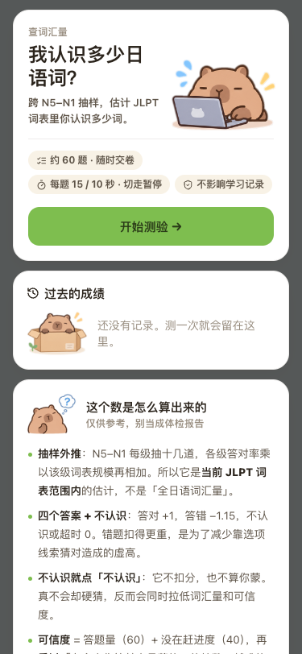
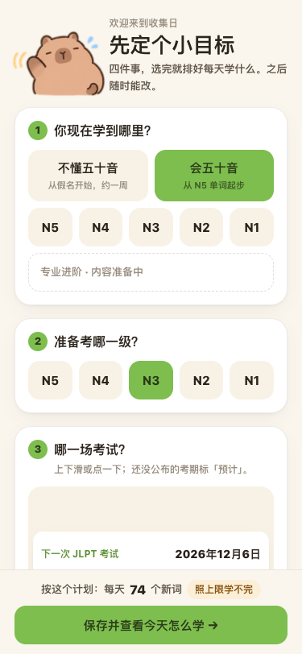
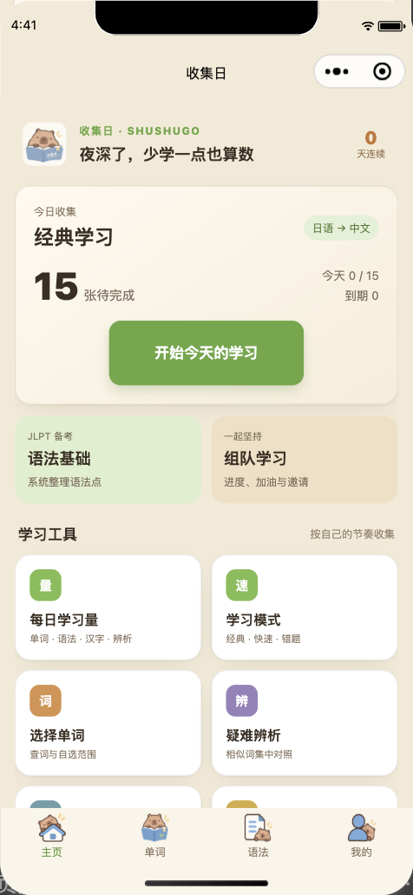
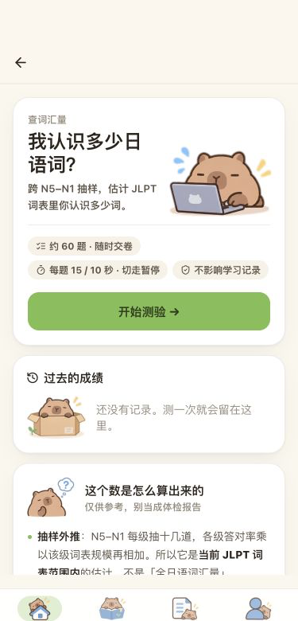
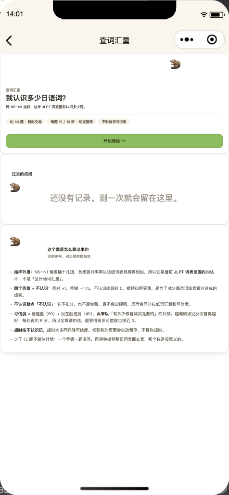
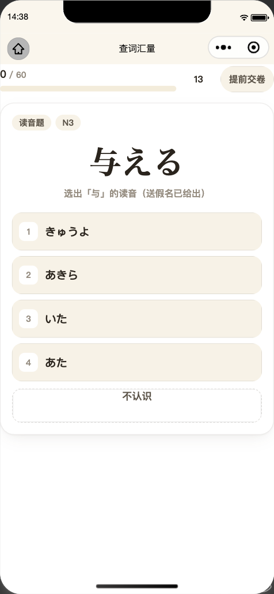
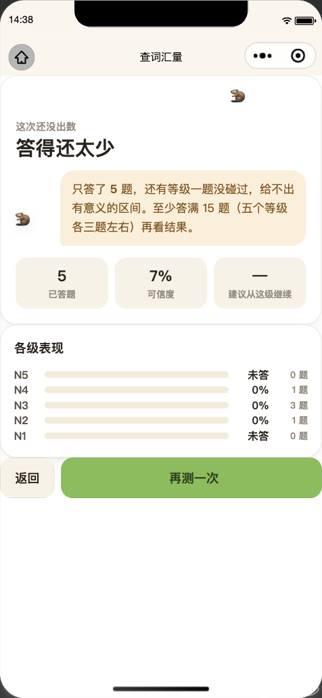

# 小程序跟着网页走：开发计划（2026-09-25）

> 写给之后接手的所有 AI（Claude / Codex / 任何人）。**动任何用户能看见的页面之前先读完这份。**
> 背景复盘见 CLAUDE.md「2026-09-25 复盘：小程序「对齐网页」耗了二十来个小时」。

## 用户要的是什么

用户原话：「我只希望我对着网页端提出要求，小程序能尽可能同步，而不是以后要改个什么都要开三个对话：
两个讲小程序和网页分别怎么改，一个还要监督有没有改得一模一样。」

翻译成验收标准：

1. **用户只描述网页上的改动**。一次对话、一个提交里，网页和小程序一起改完。
2. **「两端一样」由机器检查，不由用户检查。** 不能再出现用户自己截图对比、再开一个对话去查的情况。
3. 例外只有 CLAUDE.md 里那条最高优先级规则允许的：微信支付流程、少数有官方依据的平台适配，其余差异要用户点头。

## 现在卡在哪

| 层 | 两端是不是一份 | 说明 |
|---|---|---|
| 业务逻辑（FSRS、计划、同步、成绩、权益） | ✅ 一份 | `frontend/src/lib` 经 `wechat-miniprogram/scripts/build-shared.mjs` 打成 `src/shared/web.js`，`npm run check-shared` 钉着 |
| iOS / Android App | ✅ 一份 | Capacitor 直接用网页构建产物，天然同步 |
| **页面（结构、样式、交互）** | ❌ 两份 | 网页是 React + Tailwind + `design.css`，小程序是手写 WXML/WXSS。**所有「不一样」都出在这一层** |

所以要解决的只有页面这一层。三条路，按推荐顺序：

## 路线 A（首选，先花 1–2 天验证）：同一份 TSX 编译成小程序

用 [Taro](https://docs.taro.zone/docs/) 的 React 运行时 + [`@tarojs/plugin-html`](https://docs.taro.zone/docs/use-h5)：
网页现有的 `div / span / img` 组件可以直接在小程序里跑，**页面源码只有一份**，改网页就是改小程序。
小程序专用的部分用 Taro 的平台文件后缀（`Xxx.weapp.tsx` 覆盖 `Xxx.tsx`），支付、`wx.login` 这些薄适配放在那里，
数据层继续用现在的 `frontend/src/lib`。

已知障碍（2026-09-25 查的）：

| 障碍 | 实情 | 怎么处理 |
|---|---|---|
| Taro 4 的 React 渲染器只支持 React 18，网页是 React 19 | grep 过，网页**没用** `use()` / `useActionState` / `useOptimistic` / `useFormStatus` 这些 19 独有的 API | 网页退回 React 18。iOS 包同步退，属于同一份构建 |
| `span` 在 plugin-html 里映射成 `View`，默认块级 | 官方文档写明 | 给 `span` 补 `display:inline` 基础样式 |
| 13 个文件用了 `createPortal`，28 个文件碰 `document.* / getBoundingClientRect / <canvas>` | 小程序没有 DOM，尺寸查询是异步的 | 包一层 `lib/platform/*`（弹层、量尺寸、画布），网页实现照旧，`.weapp.ts` 给小程序实现。**这是路线 A 的主要工作量** |
| Tailwind 任意值类名（`bg-[#464949]`）、`:has()`（`app.css` / `styles.css` 在用）、挂在 `html` 上的 `[data-theme]` / `[data-skin]` | WXSS 不认这些 | Tailwind 走 `weapp-tailwindcss` 一类的转义插件；`:has()` 改写；主题属性改挂页面根节点 |
| 主包 2 MiB | 现在主包约 1.97 MiB，`web.js` 634 KB | Taro 运行时 + React 要进主包，**这是最可能不过的一关**，spike 第一件事就量它。页面尽量进分包 |
| sql.js | 小程序已经在用 `WXWebAssembly` 跑 sql.js（`src/runtime/sqlite.js`） | 沿用，不动 |

### Spike 怎么做、什么算过

在独立 worktree（`claude/taro-spike` 或 `codex/taro-spike`）里做，**不碰 5173 所在的主目录**：

1. 建一个 Taro 4 + React 18 + plugin-html 的小程序壳，数据层 require 现有 `frontend/src/lib`。
2. 选**一个真页面**直接编译进去，不许改写：建议 `VocabTestPage`（有答题、倒计时、结果、分享），
   或组队页（网页和小程序都有，方便对比）。
3. 在微信开发者工具里打开，和 5173 手机宽度（375×812）截图对比。

**过关条件，四条都要满足：**

- 同一个 `.tsx` 文件同时是网页和小程序的源码，小程序侧只多了 `.weapp.*` 适配文件；
- 主包 ≤ 2 MiB（含 Taro 运行时、React、`web.js`），并估出全部页面迁完后的主包 / 分包体积；
- 答题点击到换卡的延迟在真机上不比现有原生版明显慢（量一下，写数字）；
- 截图和网页肉眼看是同一个页面。

过了就按页迁移，原生 WXML 页面迁完一页删一页。**没过就写清楚卡在哪一条、有什么数字，走路线 B**，不要硬撑。

## 路线 B（A 不过时）：保留原生小程序，但把「同步」变成机械活 + 机器检查

页面还是两份，但做三件事，让「一个对话改完两端」成立：

1. **能自动生成的都自动生成，不许手抄**
   - 颜色、圆角、字号这些设计变量：构建脚本从 `frontend/src/design.css` 的 `:root` / 主题段落生成
     `wechat-miniprogram/src/styles/tokens.wxss`，小程序页面只引用变量。改网页配色 = 改小程序配色。
   - 贴纸、图标：构建脚本从 `frontend/public/brand/` 压缩拷贝到小程序（Codex 09-24 压过一份，在 `refs/archive/worktree/miniprogram-parity-20260924` 的 `wechat-miniprogram/src/assets/home/*.webp`）。
   - 业务逻辑：已经是 `web.js`，保持。

2. **页面对照表 + 提交闸门**
   - `wechat-miniprogram/parity-map.json`：网页文件 → 小程序页面文件（如 `frontend/src/pages/VocabTestPage.tsx` →
     `wechat-miniprogram/src/features/vocab-test/index.{wxml,wxss,js}`）。
   - `scripts/check-parity.mjs`（进 `npm test` 和 CI）：一个提交里改了对照表左边的文件、右边一个没动，就失败；
     除非提交信息里写了 `Parity-Exempt: <原因>`，而原因必须是用户在对话里批准过的。
   - 这一条的意义是：**AI 不可能「只改了网页就说做完了」**。

3. **截图对比代替人工监督**
   - `scripts/parity-screenshots.mjs`：用同一份种子库，Playwright 按 375×812 截网页，
     `miniprogram-automator` 截开发者工具里的同一页，拼成左右对照的 HTML 报告。
   - AI 改完必须自己看这份报告，把它附在回复里，再说完成。

Codex 09-24 逐页手写的那一版（`refs/archive/worktree/miniprogram-parity-20260924`）只在走路线 B 时有一点用，
而且只能取「数据怎么接」的部分，**页面的 WXML/WXSS 和那十来个 `*-page-smoke` 一律不要**：
快速复习 / 合并重复词条 / 一键完成 / 学习计时在 `runtime/learning.js` 的转发，`backup.js` 合并前恢复点，
`database-store.resetToSeed`，`auth.js` 多存的账号字段（都登记成了设备本地键，不上云），语法详情投影
`features/content/grammar-details.js`，`frontend/src/lib/grammar-mastery.ts`，`confusion-groups.ts` 新导出的三个函数
（⚠️ 抽出来时把 `ConfusionPage.tsx` 里说明「为什么」的注释丢了，取的时候一起搬回来）。
走路线 A 就全部用不上：页面直接调 `frontend/src/lib`，不需要这层转发。

移植方法照 CLAUDE.md 那节复盘：**搬网页渲染出来的 DOM 和编译后的 CSS**
（`div→view`、`span/p→text`、`img→image`、`className→class`、`{cond && …}→wx:if`、`.map→wx:for`、`onClick→bindtap`，
状态放进 `setData`，数据调 `web.js`），**不许读完 React 源码「按意思重写」**。

## 路线 C（不推荐）：`<web-view>` 直接嵌网页

看起来最省事，但：需要业务域名（ICP 备案、校验文件），个人主体不能用；虚拟支付不能在 web-view 里直接拉起，
要跳回原生页；web-view 里的 IndexedDB 和小程序本地库是两份数据；整站套壳有被审核按「功能过于简单 / 套壳」驳回的风险。
只有 A、B 都走不通时再考虑，而且要先核实主体类型和域名备案。

## 以后任何 AI 接到「改一下 X」时的流程（A、B 都适用）

1. 用户说的是网页上的样子 → 默认两端都改，**同一个对话、同一个提交**。不要问「小程序要不要一起改」。
2. 在 worktree 里做（主目录跑着用户的 5173 学习页，不能热更新），做完当场合回 `main`、删 worktree。
3. 跑 `wechat-miniprogram` 的 `npm test`（含 `check-shared`，B 路线还有 `check-parity`）和网页相关测试。
4. 附上两端截图对照（B 路线用报告，A 路线直接截两边）。
5. 只有微信确实做不到时才停下来问，按 CLAUDE.md 最高优先级规则的格式列差异。

## 禁止事项（每一条都是 2026-09-22 ～ 09-24 真实浪费过的）

- ❌ 读完网页源码后「按自己理解」重写小程序页面（8-24 第一版、9-22、9-24 三次都是这样，三次都不像）。
- ❌ 每页新写一个断言 WXML 绑定名的 smoke 脚本——版式一换全废，还要维护。
- ❌ 用户说改 A，顺手扩到 B、C、D 页（9-24 那次从 4 张截图扩到个人资料 / 帮助 / 关于 / 隐私）。
- ❌ 在隔离目录做完不提交、不合回（9-22 的 `miniprogram-ui-merge`、9-24 已部署却没提交的付费代码）。
- ❌ 报完成时只说「测试全绿」。测试绿只证明逻辑没坏，不证明长得一样。

## 下一步

**状态更新（2026-09-25）**：下文是路线 A spike 执行前的计划。A 已完成且未通过；用户要求继续后，已转做路线 B，记录见本文末尾。下方“等用户批准”是当时的历史待办，批准已取得。

等用户批准路线 A 的 spike。批准后由**一个**会话在 worktree 里做完 spike，把四条过关条件的结果（带数字和截图）写回本文件末尾，
再由用户决定走 A 还是 B。（此待办已完成，结果和后续决定见下文。）

**2026-09-25 复查补记**：第一轮 spike 的体积失败主要来自 11 MB 的 `jlpt_words_seed` 被并进页面（原生小程序用 `build-shared.mjs` 的 `SHIMS` 早就挡掉了），
WXSS 报错来自一个 `::highlight` 选择器，真正难的弹层 / DOM / 真机速度都没测到。所以安排了第二轮，计划在 [`TARO_SPIKE_ROUND2.md`](TARO_SPIKE_ROUND2.md)，
结果出来前路线 B 照常作为兜底保留。

## 路线 A Spike 实测记录（2026-09-25）

> 状态说明：用户已批准路线 A spike，以下记录本次已完成的实测；上文“等用户批准”这一等待条件已满足。

### 实验范围

- 在独立 worktree `codex/taro-spike` 中用 Taro 4.2.1、React 18.3.1、Webpack 5 和 `@tarojs/plugin-html` 建了一个小程序壳。首页直接导入 `frontend/src/pages/VocabTestPage.tsx`，没有复制或改写该页面；数据入口临时接到现有小程序 `database-store`，仅增加 spike 用适配器。
- React / React DOM / 类型包从 19 降到 18 只发生在 spike worktree；正式网页和 iOS 构建没有改动，跨平台统一降级仍未验证。
- 开发者工具只打开该 worktree。项目配置里的同步地址为空；本地模拟只使用仓库出厂库 `frontend/public/nihongo.db`，不含个人学习库，也没有上传小程序。
- 网页对照不是 5173 学习窗口：在同一 worktree 用 Vite 5174 和独立浏览器上下文打开同一 `VocabTestPage`，数据库来自出厂库。该端口不接收 5173 的学习快照，worktree 中也没有 `.local/live.db`。

### 四条过关条件

| 条件 | 结果 | 实测证据 |
|---|---|---|
| 同一个 `.tsx` 同时是网页和小程序源码 | **通过（仅源码同源）** | Taro 页面入口直接导入 `frontend/src/pages/VocabTestPage.tsx`；原页面源码未改。要达到可用仍需补小程序平台适配。 |
| 主包 ≤ 2 MiB，并估算迁移后体积 | **失败** | `CI=1 npm run build:weapp` 编译成功，但生成产物没有分包；排除仅供本地调试的 11,567,104 字节出厂库后仍为 **24,378,499 字节（23.25 MiB）**，是 2 MiB 上限的 **11.62 倍**。单页 `pages/index/index.js` 为 **21,476,017 字节（20.48 MiB）**；`app.wxss` 为 265,904 字节。完整页面迁移至少从这一个页面的 23.25 MiB 起步，后续页面只会增加代码；当前输出连单独放进一个分包也超限。 |
| 真机答题点击到换卡延迟 | **未测，不能算通过** | 开发者工具没有显示页面，未执行答题；没有真机数据。 |
| 375×812 截图看起来一致 | **失败** | 网页正常显示介绍页；小程序模拟器显示 WXSS 编译错误，页面为空白，无法做相似页面对比。开发者工具控制台还报 `Right-hand side of 'instanceof' is not an object`。 |

网页截图使用 375×812 视口；小程序截图来自 iPhone 12/13 Pro 模拟器，缩放到同宽展示。模拟器控制台的 WXSS 报错定位到不受支持的 `::highlight(grammar-highlight)` 选择器。接入 `weapp-tailwindcss` Webpack 插件后，WXSS 仍未通过；React 运行时异常也需要单独定位。HTML 转换、Portal、SVG、`document`/Canvas 等平台适配仍未验证，尚未进入真机性能测量。

<table>
  <tr><th>网页：375×812，5174，出厂库</th><th>微信开发者工具：同一页面入口未能渲染</th></tr>
  <tr>
    <td></td>
    <td></td>
  </tr>
</table>

### 结论

**路线 A 未通过**，主因是单页产物超过微信单包上限 11 倍以上；开发者工具还存在 WXSS 编译错误和 React 运行时异常。按原计划转路线 B 前，需由用户决定是否继续（此决定已于 2026-09-25 作出，见下文）。Taro / Tailwind 接入依据：[Taro 小程序 HTML 插件说明](https://docs.taro.zone/docs/use-h5)、[weapp-tailwindcss 的 Taro Webpack 配置](https://tw.weapp.dev/docs/quick-start/frameworks/taro)。

## 路线 B 落地记录（2026-09-25）

> 本记录更新了上面的旧结论：用户要求继续路线 B，并批准启用本机 CLI/HTTP 自动化、信任本次临时项目。正式工作均在独立 worktree 完成；5173 和主目录中的个人学习库未访问或修改。

### 已落地的同步机制

1. `scripts/sync-design-tokens.mjs` 从 `frontend/src/design.css` 的浅色 / 深色变量段生成 `src/styles/tokens.wxss`，并由 `check-design-tokens` 比对是否过期。颜色、圆角和字号 token 都从网页设计表读取；圆角和字号按 375px 网页基准换算为 WXSS `rpx`。WXSS 不支持的 `color-mix()` 值沿用小程序现有 fallback。首页卡片、通用功能卡片、区块标题、说明文字和按钮已引用生成变量；旧页面仍有各自的样式值，后续改动应逐步收敛到这些 token。
2. `scripts/sync-brand-assets.mjs` 依据 `scripts/brand-assets.json` 压缩所需的品牌资源，并生成哈希清单供 `check-brand-assets` 校验。目前同步 Web 与小程序首页、关于页共用的吉祥物图标，Web 原图为 258,201 字节，小程序 WebP 为 19,048 字节。品牌目录约 21 MiB，清单只纳入当前小程序实际使用的资源；新增 Web 品牌资源若进入同步范围，须同时登记清单与小程序对应项。
3. `parity-map.json` 记录网页文件与小程序文件的对应关系；没有对应页面的文件保持空目标，任何对应关系缺失或只改网页侧都会让 `check-parity` 失败。`npm test` 自动运行该检查，CI 对 PR 的 base/head 逐提交检查，并继续执行现有全部小程序脚本。豁免原因必须在映射表登记，且提交信息带 `Parity-Exempt: <原因>`。
4. `scripts/parity-screenshots.mjs` 用 Playwright 截隔离端口的网页，用微信开发者工具 CLI 和 `miniprogram-automator` 截小程序，再生成 HTML 对照报告。脚本拒绝 5173、非本机网址和含 `.local/live.db` 的 worktree；临时项目使用 `touristappid`、独立目录和出厂数据库，额外启动空白引导页，并把数据库写入独立用户目录，避免加载已有模拟器数据；云 / 同步 / 支付地址清空，退出时关闭项目并清理数据库及临时目录。服务端口从开发者工具“设置 → 安全设置”读取，通过 `--cli-http-port` 传入；自动信任只由该次 CLI 命令的 `--trust-project` 指向临时项目，没有打开全局默认信任开关。

本地运行截图：在 worktree 启动隔离 Vite `npm --prefix frontend run dev -- --host 127.0.0.1 --port 5194 --strictPort`，再执行 `node wechat-miniprogram/scripts/parity-screenshots.mjs --web-url http://127.0.0.1:5194/ --mini-route /pages/home/index --cli-http-port <安全设置端口> --output-dir docs/assets/route-b-parity`。端口值取自开发者工具“设置 → 安全设置”，不能用 5173。

### 验证结果和当前视觉差异

- `TZ=Asia/Shanghai npm test`：28 个小程序检查全部通过；`check-shared`、预算、生成变量、品牌资源和页面配对均通过。
- 页面配对负向检查：只改 `frontend/src/pages/TeamPage.tsx` 会失败并指出对应的小程序页面没有变化；恢复文件后检查通过。
- 微信开发者工具自动化已运行，安全设置中服务端口原已开启（49985），未更改全局设置。报告由隔离的 5194 网页端口和 `touristappid` 临时项目生成，使用仓库出厂种子库；没有用 5173。
- 首页截图揭示了真实差异：网页出厂库首次启动时显示“先定个小目标”计划设置层，小程序截图显示原生首页；两图因此不是完全相同的首屏状态。开发者工具页面窗口为 390 × 753，报告保留包含系统栏的原截图 476 × 1030；网页截图为 375 × 812。当前报告用于发现差异，不能作为视觉一致的验收结论。

对照图：

<table>
  <tr><th>网页（375 × 812；首次启动设置层）</th><th>微信开发者工具（首页；390 × 753 页面窗口）</th></tr>
  <tr>
    <td></td>
    <td></td>
  </tr>
</table>

完整报告：[网页 / 小程序首页对照](assets/route-b-parity/report.html)。后续每次网页 UI 改动仍须在同一提交更新对应小程序文件，并检查实际对照报告；映射表里未登记的 Web 组件变更会被拦下，须先确定它的小程序对应项。

## 路线 A 第二轮实测记录（2026-09-25）

> 结论：生产构建与包体门槛通过，但查词汇量主流程未走通，视觉差异明显；路线 A 本轮不通过。

### 实验边界

- 试验在独立 worktree 分支 `codex/taro-spike-2` 执行，基于当时本地 `main` 的 `48c3b6a`。Taro 4.2.1、React 18.3.1、Webpack 5、`@tarojs/plugin-html` 生产构建成功。
- 页面入口直接导入 `frontend/src/pages/VocabTestPage.tsx`。`VocabTestPage.tsx` 与 `WordStudy.tsx` 的页面源码 diff 均为空；没有改 `frontend/src/`，没有改路线 B 配对表。
- 网页对照使用隔离 Vite 端口 5194，出厂数据库由仅绑定 `127.0.0.1:5195` 的临时服务提供；开发者工具只打开试验项目。云端地址与 ID 均清空，只用 `frontend/public/nihongo.db`，未读取 `.local/live.db`，没有上传、预览或提审。两个临时服务已关闭。
- 主目录的 5173 学习页没有操作或刷新。网页源文件、学习数据和已有未提交改动未触碰。

### 六条过关条件

| # | 结果 | 数字与证据 |
|---|---|---|
| 1 | **未通过（源码部分同源）** | `VocabTestPage.tsx` 由 Taro 入口直接 import，两个页面文件的 diff 为空；但 `WordStudy.tsx` 未编译。第 3 步未通过后，按本计划条件跳过第 4 步。Taro 侧适配列于下表。 |
| 2 | **部分通过** | 主包 **1,256,398 B（1.198 MiB）**；`features` 分包 **1,835,040 B（1.750 MiB）**；实测合计 **3,091,438 B（2.948 MiB）**。主包与该分包均低于 **2,097,152 B（2 MiB）**。主包含 `sql-wasm.wasm` 的 **659,730 B**。全部页面迁移未估；Webpack 另有共享 entrypoint **2.02 MiB** 警告，分包根目录的实测数字见 `taro-spike-2/reports/package-sizes.json`。 |
| 3 | **未通过** | 开发者工具能显示查词汇量落地页，但“开始测验”无状态变化。`Element.tap()`、`trigger tap`、`dispatchEvent click` 和界面点击均未触发页面跳转；未到第 1 题，无法答 5 题、提前交卷或查看结果。 |
| 4 | **未测** | 没有“点评分 → 下一张”可用流程，因此没有 20 次计时、中位数或最大值，也没有与原生版比较。未生成预览二维码：本轮硬规则禁止上传或预览；真机验收待以后获准生成二维码后进行。 |
| 5 | **未通过** | 两端均截在查词汇量落地页。Taro 截图出现 🦫 占位表情，网页使用原吉祥物图；Taro 的文字、卡片和留白也明显更小。网页 DOM 视口为 **375×812**，截图接口实际输出 **375×780**；DevTools 截图为 **476×1030**。对照图见下方。 |
| 6 | **通过** | `cd frontend && npm run check` 通过；`npm test` 通过，**112 个测试文件通过、2 个跳过；789 项测试通过、26 项跳过**。网页只在 5194 对照，没有改源码；5173 未操作。 |

<table>
  <tr><th>网页：DOM 视口 375×812；截图文件 375×780</th><th>Taro：微信开发者工具落地页，截图 476×1030</th></tr>
  <tr>
    <td></td>
    <td></td>
  </tr>
</table>

### Taro 侧适配与影响

| 文件 | 行数 | 内容与网页影响 |
|---|---:|---|
| `taro-spike-2/src/features/vocab-test/index.tsx` | 18 | 等待现有 `database-store` 从出厂库就绪，再直接渲染原 `VocabTestPage`；只影响试验入口。 |
| `taro-spike-2/src/platform/iframe-polyfill.weapp.ts`、`src/app.tsx` | 17、10 | 补 `HTMLIFrameElement`（React DOM 报错点为 `react-dom.development.js:8445`）及 `document.documentElement` 属性桩；仅 Taro 试验启用。 |
| `taro-spike-2/src/platform/mascot.weapp.tsx` | 16 | 用 🦫 表情替代网页吉祥物素材；这是截图中可见的差异，不能算视觉同源。 |
| `taro-spike-2/scripts/taro-content.cjs` | 17 | 为单页静态打入题意内容，绕过 Taro 产物中不可用的 `require.async`；其他内容加载器在此试验页中不工作。 |
| `taro-spike-2/scripts/offline-config.cjs` | 15 | 清空云地址与 ID，题库地址指向本机 5195；不接正式服务。 |
| `taro-spike-2/scripts/strip-weapp-css.cjs` | 51 | 过滤器报告剥除 **100 条选择器记录**，包括 `:where`、`:has`、`::highlight`、`@layer` 相关规则及部分伪元素 / 相邻兄弟选择器；会造成样式损失。 |
| `wechat-miniprogram/scripts/shared/shims-map.mjs`、`build-shared.mjs` | 36；文件净变化 38 行新增 / 34 行删除 | 将 `SHIMS` 抽为同一份映射供共享构建复用；只在试验分支提交，未合入主分支。 |

未用于最终构建的 `src/platform/react-dom.weapp.ts` 等失败尝试也保留在归档快照中，没有删除。

### 全量迁移工作量

- 静态盘点为 **34 个 `frontend/src/pages/*.tsx` 文件**；本次只验证 VocabTest，仍有 **33 个页面**未在 Taro 验证，其中包括 `WordStudy.tsx`。另有 **28 个**含浏览器专用 API 的 TSX 文件，以及 **13 处** `createPortal`。这些数字可能重叠，不能相加当作独立适配项。
- 本轮只完成一个页面的生产打包与落地页渲染，且在完整答题流程前受阻；没有可用于外推的“每页通过工时”，所以全量迁移的日历工时仍为**未知**。现阶段能确认的是 33 页、28 个浏览器 API 文件、13 处 Portal 尚未完成盘点适配；继续估时会变成猜测。

### 归档与建议

- 完整试验快照（包括 Taro 源码、生产 `dist`、依赖锁文件、体积统计、CSS 清单和截图）位于 `refs/archive/worktree/taro-spike-2`，提交为 `152c4e681053798129244135c1f197d05b34903f`。需要复查时可运行 `git worktree add /tmp/taro-spike-2 refs/archive/worktree/taro-spike-2`。
- 没有遇到主包或分包超过 2 MiB 的数字硬阻塞；路线 A 未通过的决定性证据是页面交互未工作，且截图不一致。速度与 WordStudy 仍无实测证据。

**建议走路线 B**：A 的查词汇量主流程仍未通，视觉差异明显，WordStudy 与真机性能也没有通过证据；当前继续 A 的剩余工作量无法可靠估算。

## 第二轮复核：哪些是做错了、哪些是真问题（Claude，2026-09-25）

> 复核方法：把 `refs/archive/worktree/taro-spike-2` 展开，在微信开发者工具里（出厂库、离线配置、不上传）实际跑，
> 再只改两处配置重新生产构建。改后的版本存在 `refs/archive/worktree/taro-spike-2-review`（`2e1b5ef`）。
> **结论：第二轮判路线 A 不通过的决定性证据（按钮点了没反应）是配置错误，不是 Taro 做不到。路线 A 没有被否定。**

### 第二轮说「没过」的，逐条定性

| 第二轮的结论 | 定性 | 证据 |
|---|---|---|
| 「开始测验」点了没反应，主流程走不通 | **做错了** | `package.json` 里**没装 `@tarojs/react`**（Taro 的小程序渲染器），`config/index.js` 还把 `react-dom` 手动别名到网页用的 react-dom。网页渲染器靠 Taro 模拟的 DOM 能把页面画出来，但它的事件系统接不上小程序的 tap，所以点了毫无反应、也不报错。第一轮的 `instanceof` 报错、第二轮不得不补的 `HTMLIFrameElement` 假对象，都是同一个原因。装上 `@tarojs/react@4.2.1`、删掉 `react-dom` 别名后：落地页 → 开始 → 答 5 题 → 提前交卷 → 结果页**全部走通、零异常**。见下图。 |
| 字、卡片、留白都比网页小一圈 | **做错了** | `designWidth: 750` 且开着 `pxtransform`：网页 CSS 按 375 宽写的 `16px` 被当成 750 设计稿换算成 `16rpx`，手机上只剩 8px。改成 `designWidth: 375` 后尺寸和网页一致。 |
| 吉祥物变成 🦫 表情 | **偷懒了** | `platform/mascot.weapp.tsx` 直接用表情顶替，贴纸图片根本没拷进包。按路线 B 已有的 `sync-brand-assets.mjs` 把用到的贴纸压成 webp 放进分包即可。 |
| 真机速度没测、没出二维码 | **计划的错** | `TARO_SPIKE_ROUND2.md` 硬规则写了「不上传」，第 5 步又要求生成预览二维码，自相矛盾。**预览二维码是开发预览、不是上传版本，下一轮允许生成**。开发者工具里复核测得点选项到页面更新 35–66 ms（含自动化工具往返）。 |
| WordStudy 没试 | 连带 | 计划规定第 3 步通过才做第 4 步，第 3 步是被上面的配置错误卡住的。 |
| 全量工作量「未知」 | 连带 | 同上，没有一页真正跑通过，无从外推。 |

<table>
  <tr><th>复核：答题页（开发者工具，改配置后）</th><th>复核：结果页</th></tr>
  <tr>
    <td></td>
    <td></td>
  </tr>
</table>

### 真问题（不是做错了，是路线 A 本来就要付的成本，下一轮要量清楚）

1. **SVG 图标全部不显示。** `@tarojs/plugin-html` 不支持 `<svg>`，控制台满屏 `Template tmpl_0_path not found`；lucide 图标全应用都在用（倒计时圈、按钮图标都没了）。要一个 `lucide-react` 的小程序替身，把图标在构建时转成图片。一次性工作。
2. **不支持的 CSS 被剥掉 100 条**（`:has`、`::highlight`、`@layer`、部分伪元素 / 兄弟选择器，清单在归档的 `reports/css-removed.json`）。看得见的要逐条改写成小程序能认的写法。一次性工作。
3. **页面外壳**：网页的页边距、顶栏、底栏在 `App.tsx` 里，单独编译一个页面就贴边了（截图顶部那行贴着左边）。要一个小程序版的外壳组件。
4. **按需加载出厂内容**：试验里题面数据（约 0.6 MB）是静态打进页面的，别的内容加载器不可用。`features` 分包因此是 1.8 MB，离每包 2 MiB 很近。要找到 Taro 下的分包异步加载做法，否则页面一多分包就会超。**这是路线 A 现在最大的未知数。**
5. **浏览器专用功能**：28 个文件、13 处 `createPortal`（`@tarojs/react` 自带 `createPortal`，但弹层定位、量尺寸、canvas 分享图没验证）。
6. **真机速度**：只有开发者工具的数，没有真机的数。

### 第三轮（给 Codex）：在 `refs/archive/worktree/taro-spike-2-review` 基础上继续

规则沿用 `TARO_SPIKE_ROUND2.md`，只改一条：**允许生成预览二维码请用户扫码测真机**（仍然不许上传版本、不许提审）。

1. **先查 Taro 官方文档确认配置再动手**：React 项目必须装 `@tarojs/react`，`react-dom` 由框架插件别名，不要自己指；`designWidth` 按网页的 375。第二轮两个决定性错误都是没看文档造成的。
2. 贴纸按 `sync-brand-assets.mjs` 的做法进分包，不许再用表情顶替。
3. `lucide-react` 小程序替身（第 1 条真问题）。
4. 小程序版页面外壳（第 3 条）。
5. **重点**：Taro 下出厂内容的分包按需加载（第 4 条）。给出做法和查词汇量页改完后的分包字节数。做不到就停下来报告，这条决定路线 A 能不能走。
6. 通过后编译 `WordStudy.tsx`，走通出卡 → 翻面 → 评分 → 下一张。
7. 预览二维码请用户扫码，测真机答题到下一题的延迟，和原生小程序对比。
8. 两端同一状态截图对照；六条过关条件逐条给数字，写回本文件末尾。
