# W6 验收记录（2026-09-26）

## 范围与环境

- Worktree：`taro/w6-events`，起点及 `taro/main` 当前点为 `77d4cd2`；本轮不再合并。
- Mini Program：微信开发者工具分配端口 `9461`，模拟器型号 iPhone 12/13 Pro，微信 8.0.5、SDK 3.16.3、窗口逻辑尺寸 390×753。
- Web：独立 Vite 端口 `5201`，Chrome 隔离上下文，viewport 375×812。用户的 `5173` 学习页未刷新；`frontend/.local/live.db` 未读写。
- 临时真机预览由微信 CLI 生成，二维码在 `/private/tmp/w6-preview-qr.jpg`（未加入仓库）；预览包共 **5,584,322 B**。扫码后首页的两个 W6 临时入口分别打开 Canvas 和触摸控件验收页。临时页面随后恢复，不会进入提交；用户扫码和真机操作仍待完成。
- Web 临时截图页已删除。

## A. 微信 API 构建闸门

`npm run build:weapp` 最后执行 `scripts/verify-weapp-apis.mjs`。清理临时页面后的构建通过：扫描 **64 个 JavaScript 文件，46 个有上下文说明的命中，0 个未授权命中**。每一条允许项都按产物文件名、前后代码特征和精确次数匹配，并写有原因；不匹配或次数变化会失败。

| 分类 | 命中数 | 判定依据 |
|---|---:|---|
| TextDecoder | 2 | `sql-wasm` 初始化前加载 `runtime/text-decoder.js`。 |
| AbortController、crypto、performance | 11 | 启动 polyfill 提供 AbortController、randomUUID 和 SQLite 随机字节填充；performance 由 `app-polyfills.weapp.ts` 的 `Date.now()` 兜底覆盖。 |
| localStorage、sessionStorage、atob、btoa | 14 | `scripts/shared/polyfill.js` 提供持久存储与 base64；sessionStorage 使用入口安装的内存 shim。 |
| URL、fetch、XMLHttpRequest | 9 | URL 的命中包含 Taro 错误文本和未调用的异步 fflate Worker 工厂；sql.js 的浏览器加载器由 `instantiateWasm` 绕过。 |
| Blob、CompressionStream、DecompressionStream、Response | 6 | 同步快照在微信分支提前返回；fflate 的 Blob 只在未使用的异步 Worker 工厂里。 |
| indexedDB | 1 | `storage.ts` 的浏览器分支不会在微信文件存储路径执行。 |
| Worker、Image | 3 | Worker 命中是错误文案或 fflate 可选异步工厂；Image 命中是 Taro 标签顺序正则中的名字。 |

负向验证：临时在占位页加 `new Blob([])` 后，完整 `npm run build:weapp` 在 API 闸门报 `Unexpected unguarded Blob` 并失败；删除探针、恢复占位页后，最终完整构建通过。模拟器实测 `typeof performance === "object"`、`typeof performance.now === "function"`；**真实 iPhone 未测**，因此不能把模拟器值当作真机证据。

## B. 触摸与 Canvas 验收

- **DailyPlanRing**：网页和 Mini Program 共用 `daily-plan-ring-geometry.ts` 的角度、边界移动与极坐标计算。小程序 Canvas 2D 在 `touchstart` 异步测量一次并缓存边界；拖动用 rAF 合并更新，只改本地状态，松手提交一次。10 个间隔采样的更新段耗时为 `0.1, 0.2, 0.1, 0, 0.1, 0.1, 0, 0.1, 0, 0.1 ms`（最大 **0.2 ms**）；拖动提交 **0 次**、松手 **1 次**。这是几何/状态更新段的耗时，不是整帧合成或真机帧率。
- **TimerRing、KanjiPairLines**：小程序改 Canvas 2D。原始模拟器截图中 SVG 圆环只剩数字、计时圈和连线不完整；新截图显示完整。周报故事按要求跳过（小程序 v1 隐藏）。
- **useRowSelection / QuickStudyPanel**：出厂词库载入 20 行；长按进入选择，拖动选中 **9/20** 项，屏幕边缘滚动后松手保留选择。答题、评分菜单、确认和提交均已走通；本机隔离模拟器 QA 库的 reviews 从 **13 增至 16**，没有触碰用户学习库。
- **DailyPlanSlider**：Web 指针拖动从 12 到 32，松手提交一次。Mini Program 通过开发者工具 `Element.trigger` 分别触发 `changing(20)` 与 `change(32)`，确认拖动中 commits=0、松手 commits=1；`slideTo` 不会模拟原生触摸，所以 **真手势仍待设备验证**。
- **GrammarTermHint、GrammarPointPopover、TokenDictionaryPopover、FloatingDoodlePen**：小程序浮层可打开；语法点结构横排、关闭按钮可见；Canvas 笔迹位于绘图区内，移动控制按钮和撤销可用。网页端同状态已在 375×812 检查。
- **GrammarHighlightProvider**：Web 的 CSS Highlights/文本选择可用；开发者工具里 `CSS`、`Highlight`、`getSelection`、`document.getSelection`、`document.createRange` 均缺失，Mini Program 夹具显示 `CSS Highlights: unavailable`。未自行设计替代交互。

## 并排截图

下表中 Web 截图均为 375×812；Mini Program 截图来自上述 390×753 模拟器。`按下/拖动/松手` 对比用于可交互组件；TimerRing 与 KanjiPairLines 对比对应状态变化。

| 操作 | Mini Program | Web 375×812 |
|---|---|---|
| SVG 失败 / Canvas 修复 | 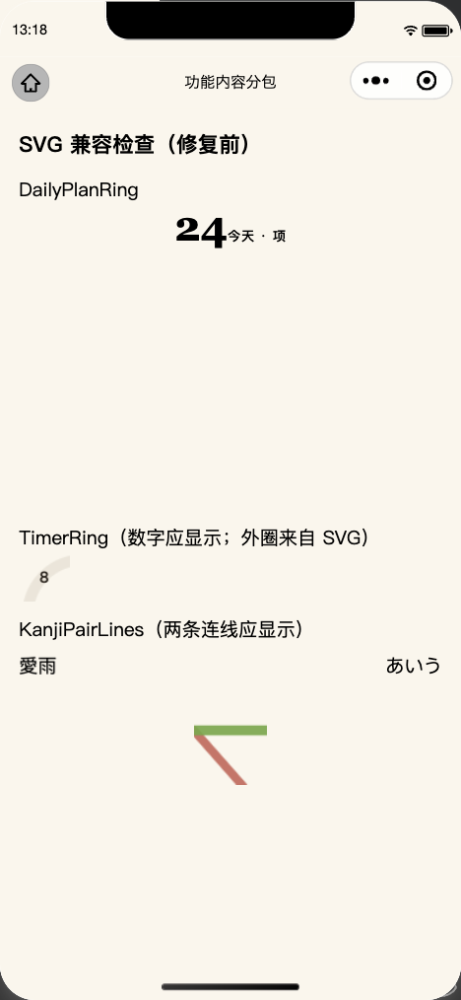 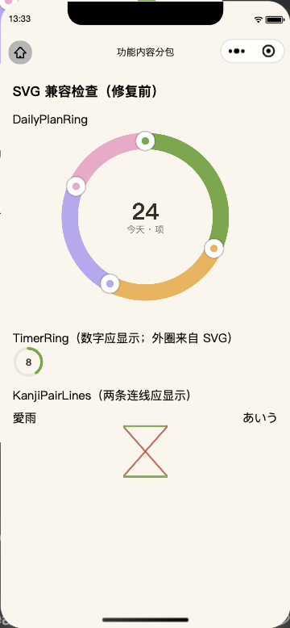 |  |
| DailyPlanRing · 按下 | 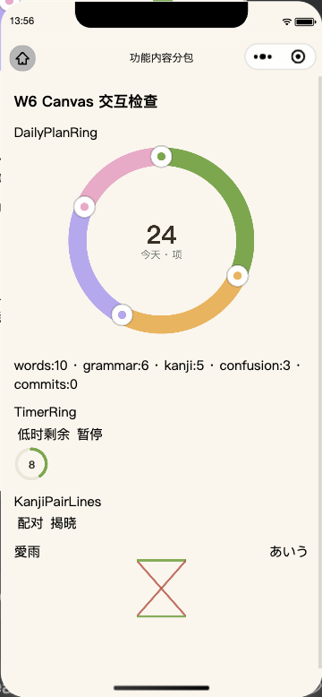 |  |
| DailyPlanRing · 拖动 |  | 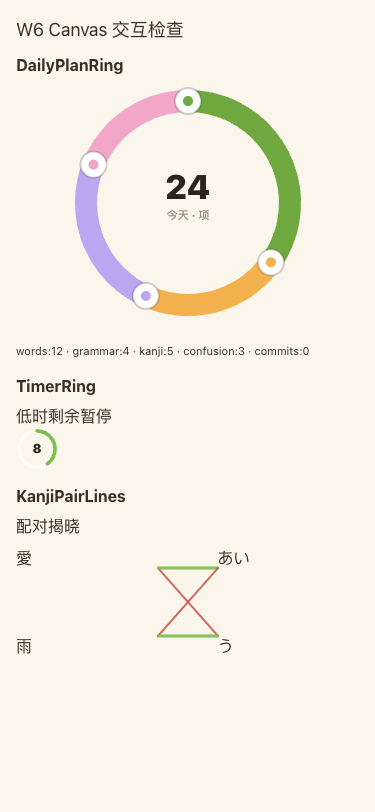 |
| DailyPlanRing · 松手 | 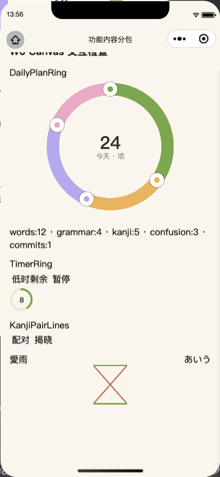 |  |
| TimerRing · 低余量 / 暂停 | 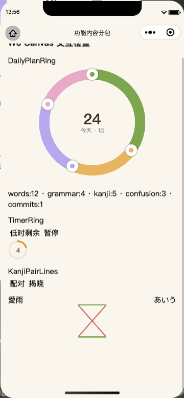  |   |
| KanjiPairLines · 配对 / 揭晓 | 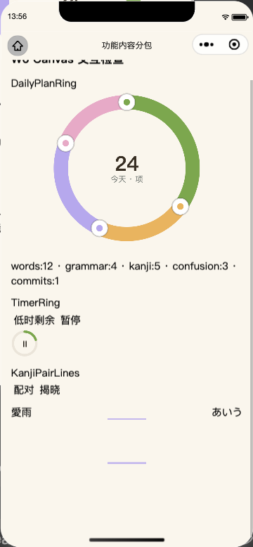  |  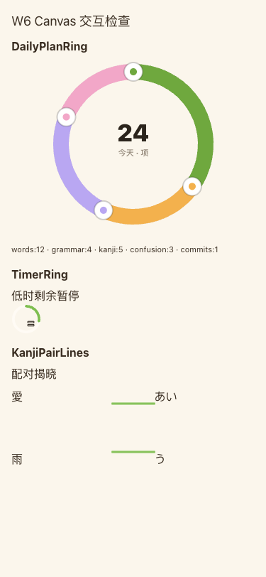 |
| DailyPlanSlider · 初始 / 拖动 / 松手 | 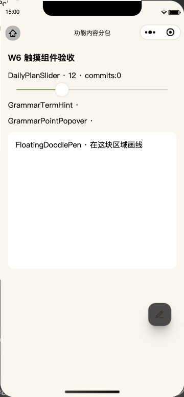 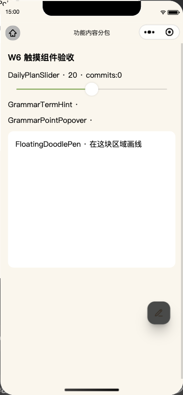 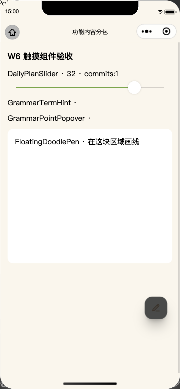 | 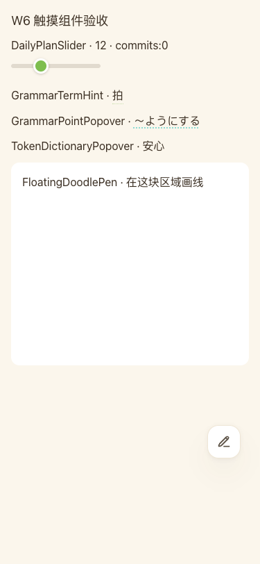 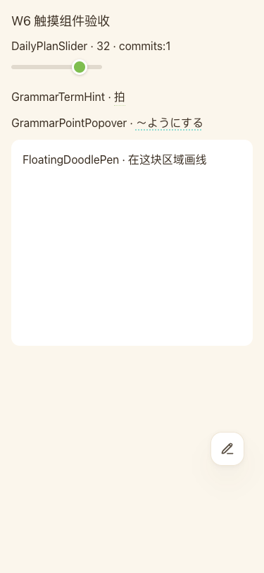 |
| QuickStudyPanel · 20 行初始 / 拖选 / 松手 | 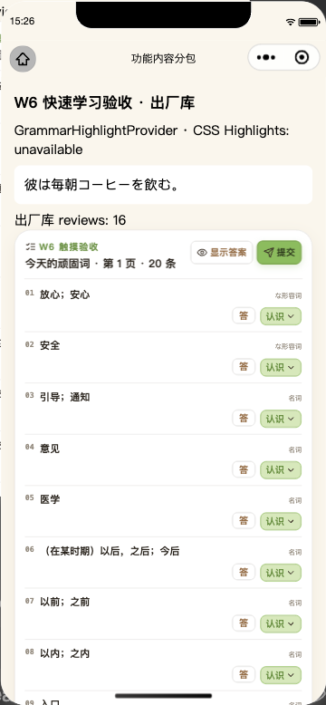 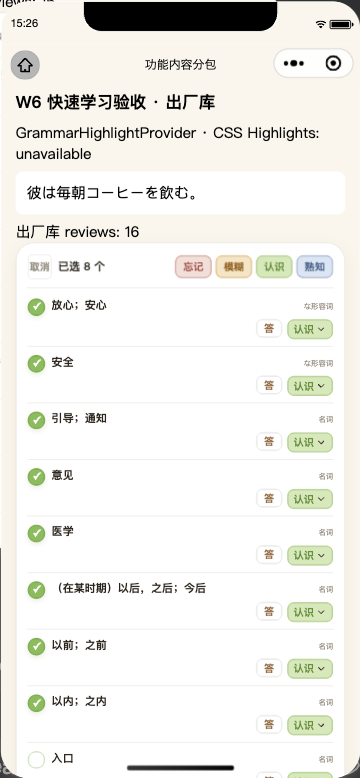 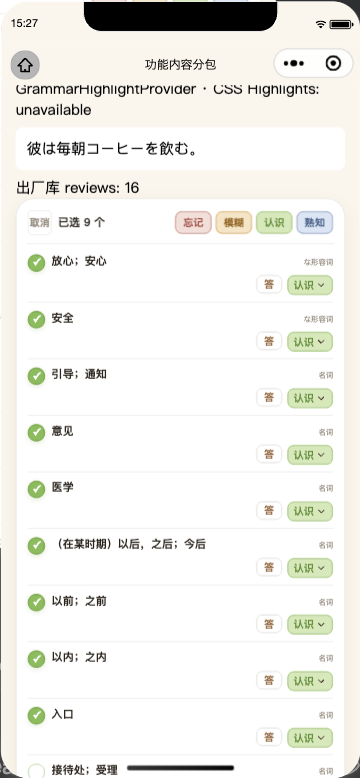 | 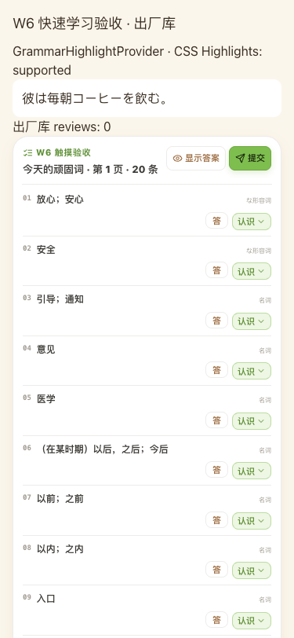 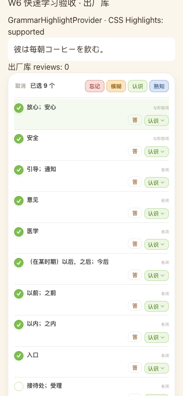 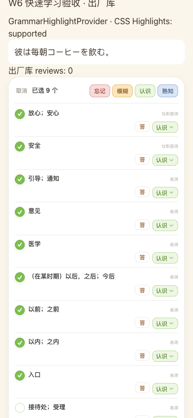 |
| GrammarTermHint · 展开 | 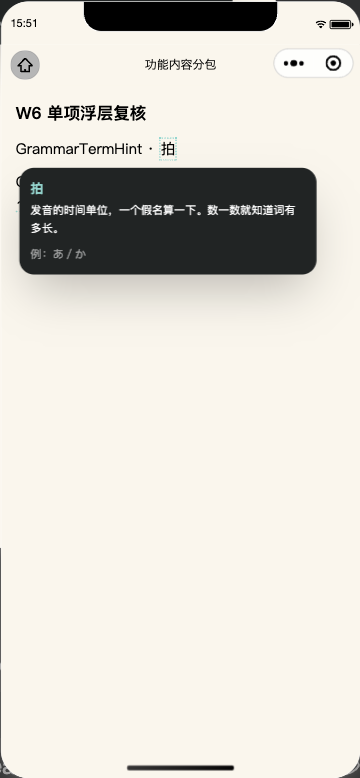 | 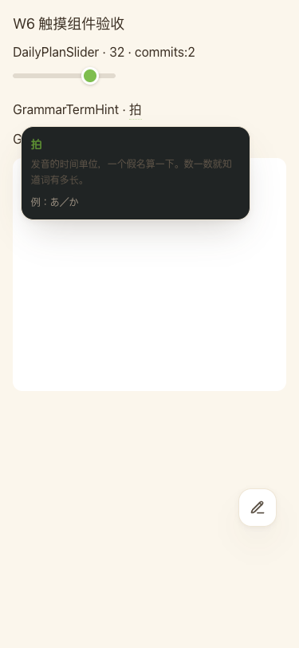 |
| GrammarPointPopover · 展开 | 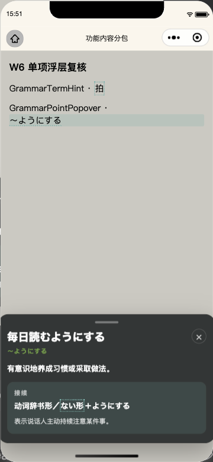 | 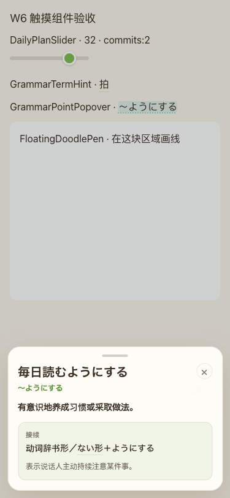 |
| TokenDictionaryPopover · 展开 | 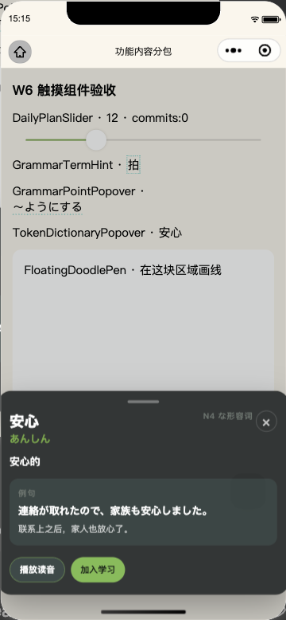 | 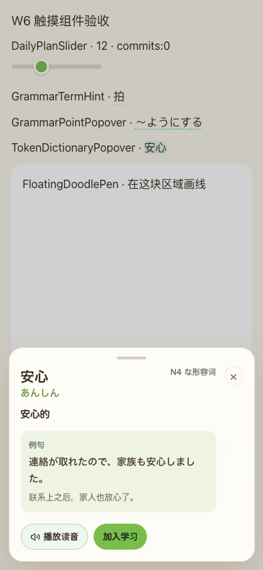 |
| FloatingDoodlePen · 初始 / 画线 / 移动按钮 |  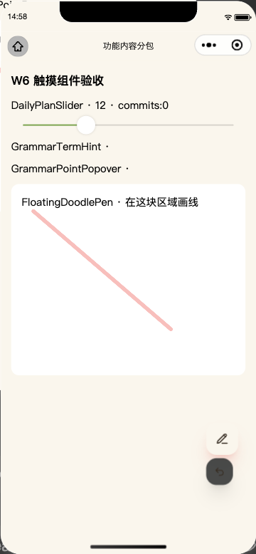 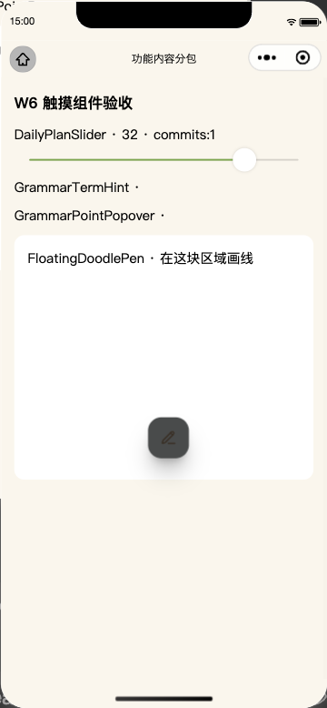 |  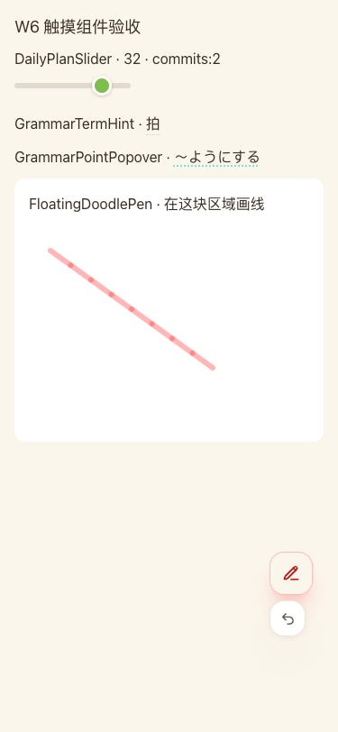 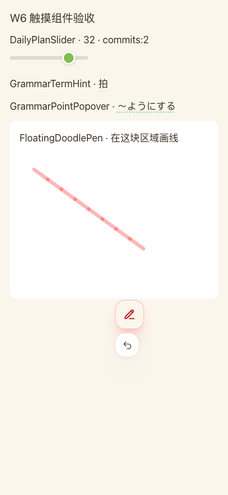 |
| GrammarHighlightProvider · 选择高亮 |  | 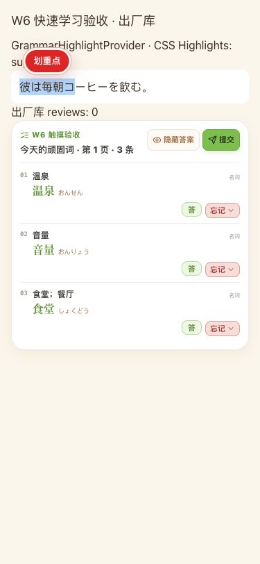 |

QuickStudyPanel 其余流程截图：[边缘滚动后](w6-mini-quick-20-edge.png)、[答案展开](w6-mini-quick-revealed-final.png)、[评分菜单](w6-mini-quick-rating-open.png)、[评分后](w6-mini-quick-rated.png)、[提交确认](w6-mini-quick-confirm.png)、[提交完成](w6-mini-quick-submitted.png)。

## 验收命令

- `frontend`: `npm run check` 通过；`npm test -- --testTimeout=15000`：**805 passed、26 skipped、0 failed**。默认 5 秒超时曾导致数据库用例超时；延长等待上限后全套通过，测试逻辑未改。
- `taro-spike-2`: 最终 `npm run build:weapp` 通过全部内容路径、包体、API 闸门；主包 **1,874,996 B**（1,900,000 B 闸门，余 25,004 B），总包 **6,154,117 B**。
- `wechat-miniprogram`: `PARITY_EXEMPT_REASON='Taro route A spike only; isolated component adapters preserve web behavior and do not change native pages' npm test`：**30 个脚本通过**。该豁免已在 `parity-map.json` 的批准列表中，适用于路线 A，不代表页面已迁移或真机通过。

## 尚未完成 / 需用户确认

1. 没有真实 iPhone 扫码验收：TimerRing / KanjiPairLines Canvas 2D 显示、真机 `performance.now` 和真实触摸性能仍待测。当前只有开发者工具证据。
2. Mini Program 的 GrammarHighlightProvider 没有 Web 可用的 Selection/CSS Highlights 能力。请决定是否要设计小程序专用的文本选择与高亮方式。
3. Mini Program 中 GrammarPointPopover、TokenDictionaryPopover 是深色面板，Web 同状态是浅色面板。请决定是否要统一成 Web 浅色，还是保留当前平台色彩。

以上视觉差异未擅自重设计；在用户决定前，不声称两端视觉完全一致。
