# W9 接口闸门与页面验收

日期：2026-09-26

分支：`taro/w9-gate-tabs`，基于 `taro/main` 的 `a450735`
工作树：`/private/tmp/shushugo-w9`。本任务未合并。

## 闸门与路由

- `npm run build:weapp` 完成。WeChat API 检查通过：30 个未守卫 API 命中、161 个 JS 文件；Taro 对象成员检查通过：357 次访问、161 个 JS 文件；`globalThis.window/document/URL` 补丁检查通过。
- 负向检查在临时产物中加入 `window.scrollTo(0, 0)`，成员闸门按预期失败；测试文件随后删除。
- Taro 成员白名单保留 17 个精确计数的访问：`window.prompt` 1、`document.createTreeWalker` 6、`document.createRange` 4、`window.getSelection` 4、`document.fonts` 1、`navigator.scheduling` 1；每项均有运行路径或守卫说明。
- 包检查通过：超限包 0、未批准的核心重复 0、Web 模块 0，总包体 7,492,977 字节。构建仍提示若干单个文件超过 244 KiB 建议值。
- 最终路由扫描逐一用 `switchTab` 打开 4 个标签页、用 `navigateTo` 打开 22 个子包页面，并检查目标路由、渲染文本和异常；26/26 通过，零页面异常和 console error。
- 网页截图来自独立端口 `5200` 和全新临时 Chrome 资料，均为 375×812。浏览器没有页面异常；首次设定时 `/__live-snapshot` 返回 404，这是独立预览不写入学习快照的保护。

## 页面截图与结论

开发者工具使用 iPhone 12/13 mini 的 375 CSS 像素视口；导出的设备截图为 466×1008（相同视口比例）。下表并排记录设备与网页画面。

<table>
  <thead><tr><th>页面</th><th>微信小程序</th><th>网页（375×812）</th><th>结论</th></tr></thead>
  <tbody>
    <tr><td>主页</td><td>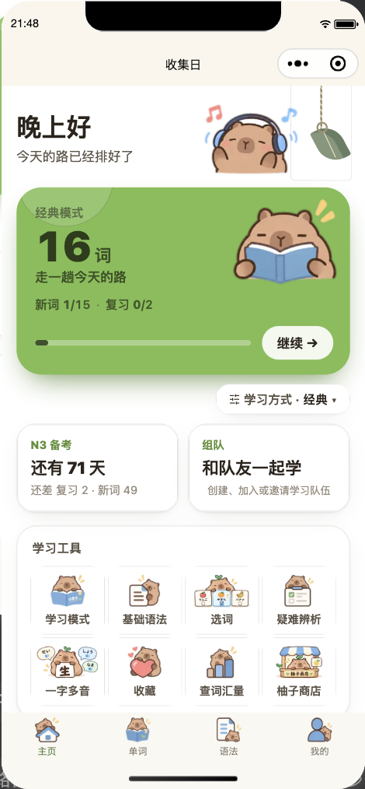</td><td>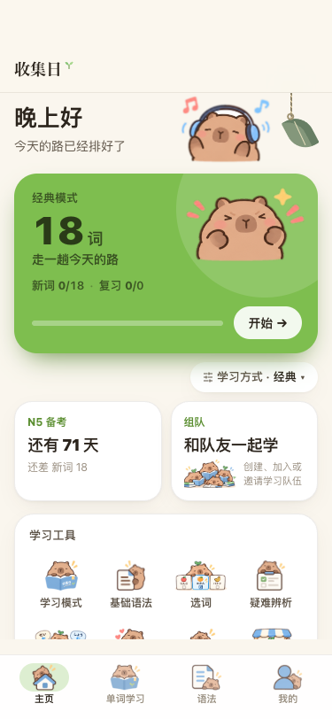</td><td>主任务卡、学习工具与底部导航都在视口内。小程序“进度概览”折叠标题的模板问题属于 W8 既有项，本任务未改。</td></tr>
    <tr><td>单词</td><td>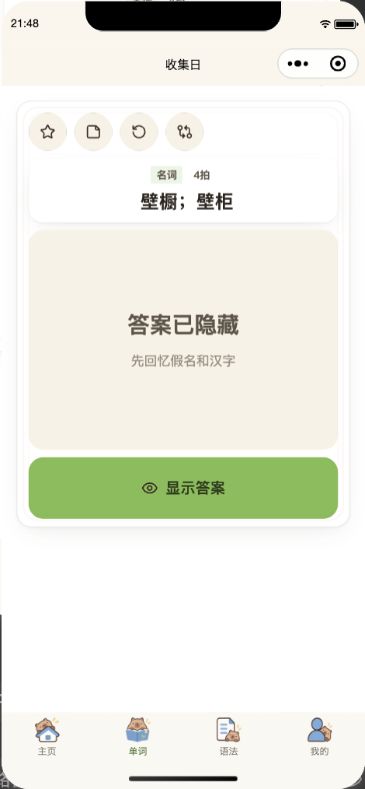</td><td>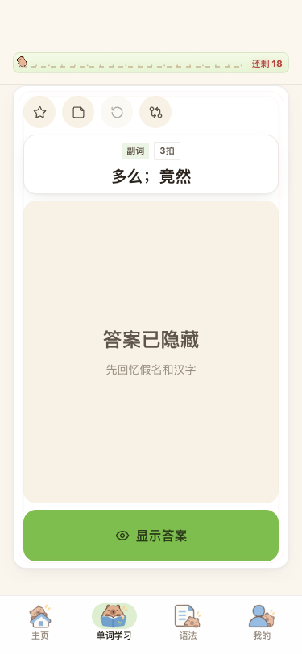</td><td>卡片与显示答案按钮未溢出；两端均不显示“按任意键”提示，小程序 WXSS 覆盖生效。</td></tr>
    <tr><td>语法</td><td>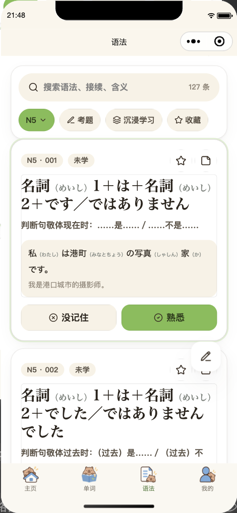</td><td>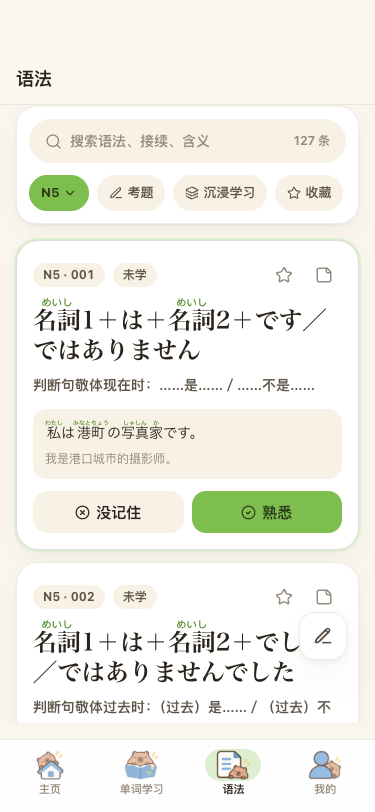</td><td>搜索、筛选、例句和作答按钮均可见，长例句在两端自然换行。</td></tr>
    <tr><td>我的</td><td>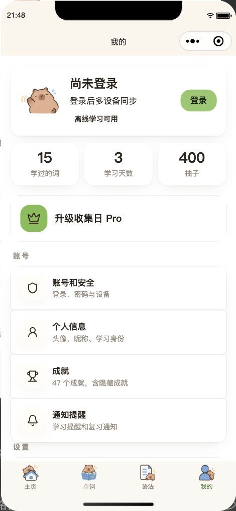</td><td>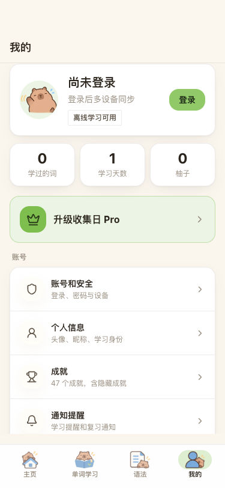</td><td>资料卡、统计卡、会员入口与账号列表无明显裁切。</td></tr>
    <tr><td>登录弹窗</td><td>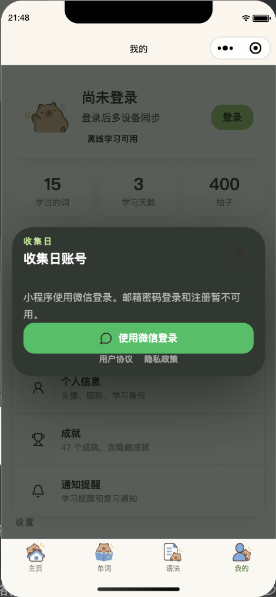</td><td>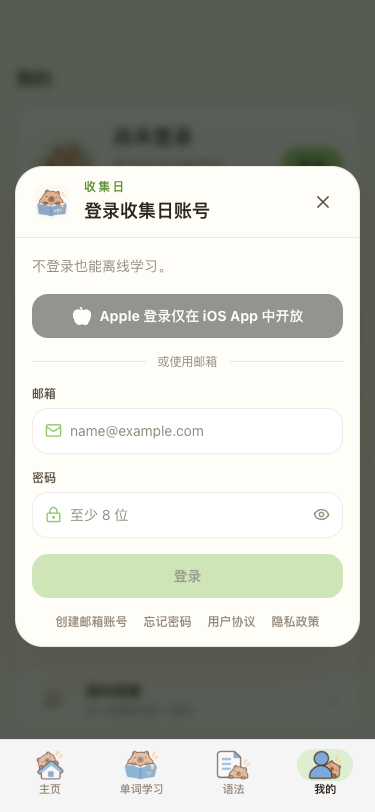</td><td>两个弹窗均完整显示。小程序仅提供微信登录；网页提供邮箱登录，Apple 登录说明为 iOS 专用。</td></tr>
    <tr><td>首次设定</td><td>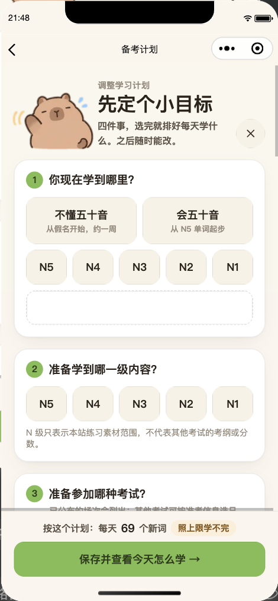</td><td>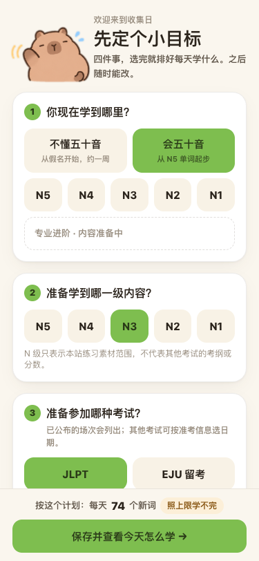</td><td>网页使用全新资料显示首次设定；小程序已有设定，因此从备考计划打开同一设定弹窗。未保存任何变更。</td></tr>
    <tr><td>Pro 付费小窗</td><td>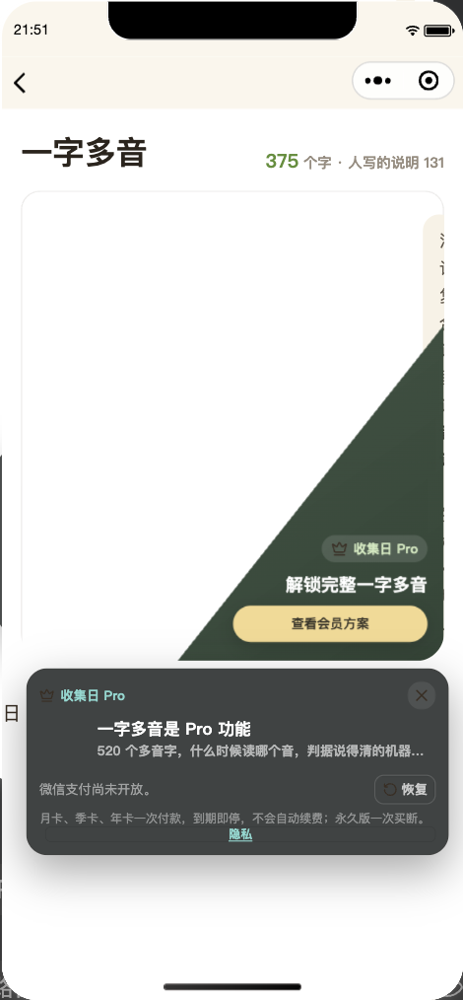</td><td>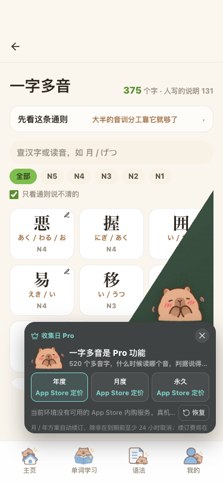</td><td>小程序仍是非全屏小窗，吉祥物与说明横排，关闭有效，底部留有安全区域；按 purchase=false 显示“微信支付尚未开放”。网页弹窗位于底栏上方，较长的购买条款可在窗内滚动。</td></tr>
  </tbody>
</table>

## 待用户确认的产品差异

- `taro-spike-2/src/app.config.js` 的 `navigationBarTitleText` 仍是“ShuShuGo · 路线 A 试验”；发布前需采用正式名称“收集日”。按任务要求，本次未自行更名。
- 小程序帮助页仍写“请通过 App Store 的应用支持入口提交问题或建议”；请确定要替换成的中文措辞。
- 网页邮箱登录与小程序微信登录的渠道差异，以及网页上的 Apple 登录 iOS 限定说明，请确认是否符合预期。
- 首页“进度概览”折叠区标题模板按任务说明交由 W8 修复；本分支没有改动该项。

## 发现的运行时问题

备考计划页和设置页共享 `DailyPlanPanel`。小程序别名选中 `DailyPlanRing.weapp.tsx`，该实现漏导出 `RING_COLORS`，导致绘制颜色时读取 `undefined.words`。现在 WeChat 变体重新导出颜色常量和 `RingValue` 类型；构建中的四条 `RING_COLORS` 导出警告消失，两个页面及完整路由扫描通过。

Paywall 预览同时暴露了小程序图片默认宽度：吉祥物的 `width:auto` 被小程序按 320px 处理，挤窄说明列。已给图片设置 40×40px，并让文字列占据剩余宽度；小程序与网页配对截图均按修复后的构建重拍。为了读取网页 opener 的 `document.activeElement`，Paywall 改走现有平台适配层；小程序变体返回 `null`，避免访问 Taro 文档上不存在的属性。

路由扫描首次访问柚子商店后，开发者工具中的柚子数由 200 变为 400（商店页面自动发放 +200）；再次扫描没有额外增加。我没有手动调整或回滚这份隔离模拟器数据。未输入登录凭据，未提交首次设定弹窗。
